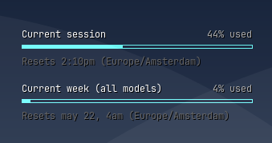

# Claude Usage Conky

A Conky desktop overlay that mirrors Claude Code's `/usage` output — session and weekly usage bars with exact reset times.

> **Note:** This is an independent project, not affiliated with or part of [ccusage](https://ccusage.com/).



## What it shows

```
Current session                   41% used
▓▓▓▓▓▓▓▓▓▓▓▓▓░░░░░░░░░░░░░░░░░░
Resets 2:09pm (Europe/Amsterdam)

Current week (all models)          4% used
▓░░░░░░░░░░░░░░░░░░░░░░░░░░░░░░░
Resets May 22, 4am (Europe/Amsterdam)
```

## How it works

The script calls `https://api.anthropic.com/api/oauth/usage` — the same endpoint Claude Code's `/usage` command uses — with the OAuth token stored in `~/.claude/.credentials.json`. No tokens are consumed and it doesn't affect your usage limit.

Results are cached in `/tmp/claude_usage_conky_cache.json` for 60 seconds so the API is only hit once per Conky refresh cycle (the config calls the script 4 times per update: header/bar/footer × 2).

## Requirements

- [Conky](https://github.com/brndnmtthws/conky) (`apt install conky`)
- A Claude Code installation with a logged-in account (`~/.claude/.credentials.json`)
- JetBrains Mono font (or edit `font` in `claude_usage_conky.conf`)

## Installation

```bash
cp claude_usage_conky.py claude_usage_conky.conf ~/.config/conky/
conky -c ~/.config/conky/claude_usage_conky.conf &
```

To start automatically on login, create `~/.config/autostart/claude-usage-conky.desktop`:

```ini
[Desktop Entry]
Type=Application
Name=Claude Usage Conky
Exec=conky -c /home/YOUR_USER/.config/conky/claude_usage_conky.conf
StartupNotify=false
Terminal=false
X-GNOME-Autostart-enabled=true
```

### Already using Conky?

**Option A — run as a second instance** (simplest, no conflicts):

```bash
# start both independently
conky -c ~/.config/conky/existing.conf &
conky -c ~/.config/conky/claude_usage_conky.conf &
```

Each instance has its own position, font, and update interval.

**Option B — merge into your existing config**:

1. Copy `claude_usage_conky.py` to `~/.config/conky/`
2. Add to your existing `conky.config` block (if not already present):
   ```lua
   default_bar_height = 4,
   default_bar_width  = 0,
   ```
3. Append to your existing `conky.text`:
   ```
   ${execp python3 ~/.config/conky/claude_usage_conky.py header session}
   ${color #4EC9B0}${execbar python3 ~/.config/conky/claude_usage_conky.py pct session}
   ${execp python3 ~/.config/conky/claude_usage_conky.py footer session}

   ${execp python3 ~/.config/conky/claude_usage_conky.py header week}
   ${color #4EC9B0}${execbar python3 ~/.config/conky/claude_usage_conky.py pct week}
   ${execp python3 ~/.config/conky/claude_usage_conky.py footer week}
   ```

## Configuration

| File | What to change |
|------|---------------|
| `claude_usage_conky.conf` | Position (`alignment`, `gap_x`, `gap_y`), font, bar height, refresh interval |
| `claude_usage_conky.py` | Timezone (`TZ`), bar color (`C_BAR`), cache TTL (`TTL`) |

**Position options** (`alignment` in `claude_usage_conky.conf`): `top_right`, `top_left`, `bottom_right`, `bottom_left`, `top_middle`, etc.

**Refresh interval**: currently 300 seconds (5 min). Safe to lower to 60s — the endpoint is lightweight metadata, not inference.
